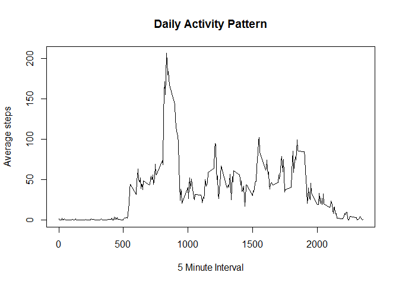
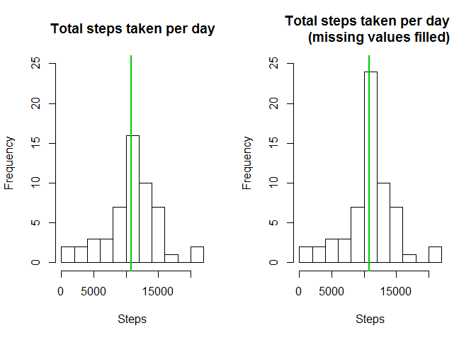

# Reproducible Research: Peer Assessment 1


## Loading and preprocessing the data
1. Set working directory to the clone folder (I do not show it in assignment because of privacy)
2. Unzip the file inside the repo and read the csv
3. Change date type

```r
unzip(zipfile="activity.zip")
data <- read.csv("activity.csv")
data$date <- as.Date(data$date)
```


## What is mean total number of steps taken per day?
1. Select the complete case
2. Sum up steps by date
3. Plot histogram

```r
cleandata <- data[complete.cases(data),]
plot1data <- tapply(cleandata$steps, cleandata$date, sum) 
hist(plot1data,10, main = "Total number of steps taken per day", xlab = "")
```

 

4. find the mean and median

```r
mean(plot1data)
```

```
## [1] 10766.19
```

```r
median(plot1data)
```

```
## [1] 10765
```

## What is the average daily activity pattern?
1. Calculate the steps mean by interval
2. Plot graph

```r
plot2data <- tapply(cleandata$steps, cleandata$interval, mean) 
plot(y = plot2data, x = names(plot2data), type = "l", xlab = "5 Minute Interval", 
     main = "Daily Activity Pattern", ylab = "Average steps")
```

 

3. Select the maximum of columns

```r
plot2data[plot2data==max(plot2data)]
```

```
##      835 
## 206.1698
```


## Imputing missing values
1. Find the missing cases

```r
sum(is.na(data))
```

```
## [1] 2304
```

2. Copy data to a new dataset
3. Fill the missing value withe the mean find previously

```r
filledmeandata <- data
filledmeandata[which(is.na(filledmeandata$steps)),1]<-
        plot2data[as.character(filledmeandata[which(is.na(filledmeandata$steps)),3])]
```

4. Check the number of missing cases again

```r
sum(is.na(filledmeandata))
```

```
## [1] 0
```

5. Sum up steps by date
6. Plot graphs

```r
filledmeanplot1data<-tapply(filledmeandata$steps, filledmeandata$date, sum)
par(mfrow=c(1,2))
hist(plot1data,10, main = "Total steps taken per day", xlab = "Steps"
     , ylim =c(0, 25))
abline(v = median(plot1data), col = 3, lwd = 2)
hist(filledmeanplot1data,10, main = "Total steps taken per day  
     (missing values filled)", xlab = "Steps",
     ylim =c(0, 25))
abline(v = median(filledmeanplot1data), col = 3, lwd = 2)
```

 

7. Find out the mean and median before and after the missing value is filled by mean value

```r
mean(plot1data)
```

```
## [1] 10766.19
```

```r
median(plot1data)
```

```
## [1] 10765
```

```r
mean(filledmeanplot1data)
```

```
## [1] 10766.19
```

```r
median(filledmeanplot1data)
```

```
## [1] 10766.19
```

8. Compare the difference before and after the missing value is filled by mean value

```r
mean(filledmeanplot1data) - mean(plot1data)
```

```
## [1] 0
```

```r
median(filledmeanplot1data) - median(plot1data)
```

```
## [1] 1.188679
```
- The mean is the same when missing values are filled because the filled value is mean
- The median is greater when missing values are filled because total steps increase


## Are there differences in activity patterns between weekdays and weekends?
I have no time to finish the this part.
